### Procedure

Procedure-Efficient RNA secondary structure prediction using the Zuker Algorithm

#### Step 1.
Open the simulator tab where user can find a user-friendly interface with different options to run the experiment. 

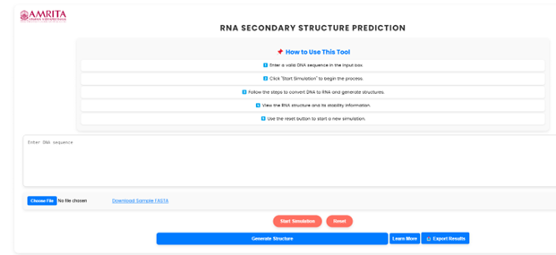

&nbsp;

•	Instructions are provided under the “How to use this Tool” section. Read through them to get familiar with the process.

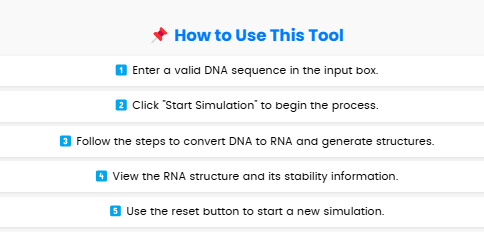

&nbsp;
#### Step 2.
User can manually enter a DNA sequence in the input box. Alternatively, download a sample .fasta DNA file from the page and upload it using the “Choose File” button. Click on “Start Simulation” to begin the experiment.

&nbsp;

#### Step 3.
Since RNA is derived from DNA, user need to convert the DNA sequence. Once the simulation starts, a “Convert DNA to RNA” button will appear. Click this button to proceed with the conversion

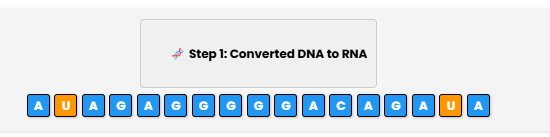

&nbsp;

#### Step 4.
After conversion, click on “Generate Possible Structures” to predict different possible RNA secondary structures.

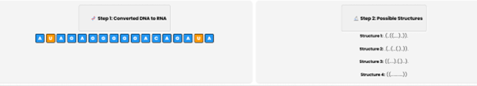

&nbsp;

#### Step 5.
To determine the stability of each structure, click on “Calculate Free Energy for Each Structure”. The simulator will compute the Gibbs free energy, which helps in identifying the most stable structure.

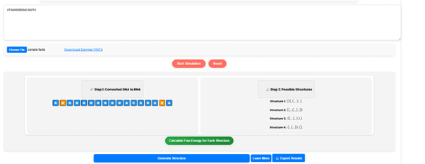

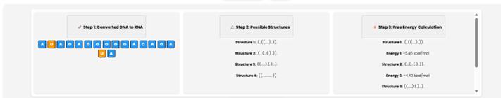

&nbsp;

#### Step 6.
Click on “Show Most Stable Structure” to see the most stable RNA structure. The system will display Structure 3 as the most stable, with a free energy value (e.g., -5.87 kcal/mol).

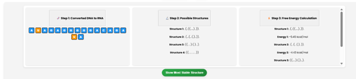

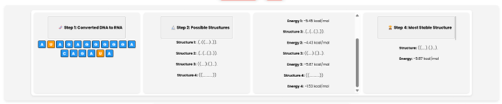

&nbsp;

#### Step 7.
Click on “Generate Structure” to get a clear visualization of the most stable RNA secondary structure. 

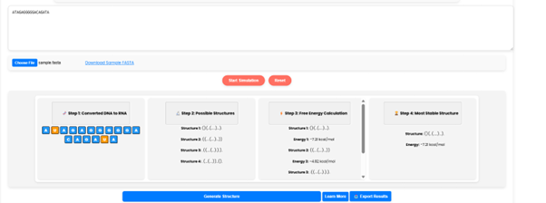

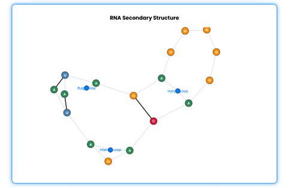

&nbsp;

•Additionally, RNA structure information will also be displayed.

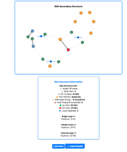

&nbsp;

#### Step 8.
Click on “Learn More” to explore detailed information about RNA loop structures.

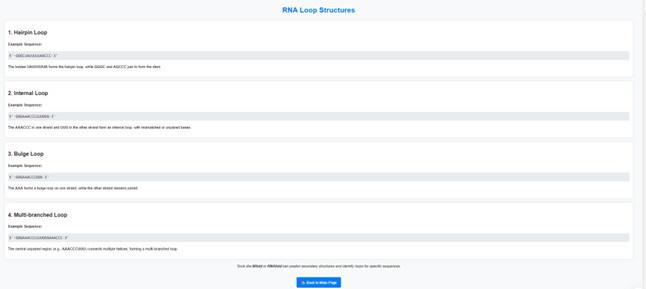

&nbsp;

#### Step 9.
User  can save the results in .png or .jpg format by clicking the “Export Results” button.

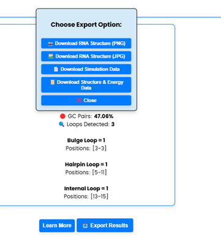

&nbsp;

#### Step 10.
User can  repeat the experiment, click on the “Reset” button to clear the current data and start again.

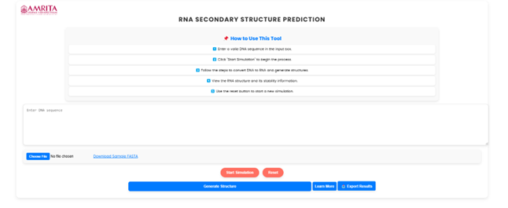

&nbsp;

