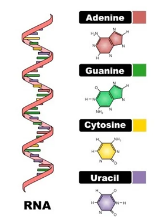
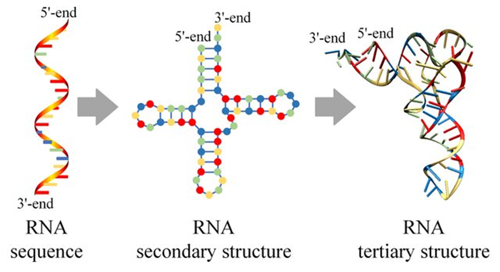
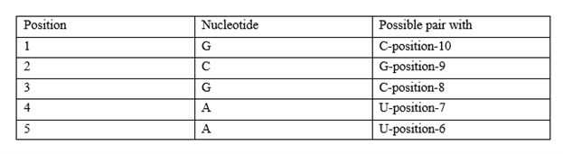
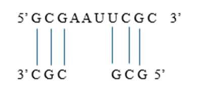

### Theory

In bioinformatics genomics research, RNA secondary structure prediction is a crucial aspect since RNA molecules play essential roles beyond encoding proteins. At the molecular level, RNA is highly dynamic and versatile, with its structure, interactions, and functions influencing key biological processes. Understanding RNA secondary structure enhances our knowledge of protein synthesis, cell differentiation, metabolism, and genetic regulation. This, in turn, helps uncover the fundamental principles governing an organism’s genetic makeup.

### Molecular Level of Ribonucleic Acid (RNA)

RNA (ribonucleic acid) is a fundamental biomolecule that plays crucial roles in genetic expression, regulation, and catalysis. RNA is typically single-stranded and exhibits unique molecular properties that allow it to function as both a carrier of genetic information and a structural and catalytic molecule

#### Composition of RNA : 

RNA consists of ribonucleotides, which serve as the building blocks of its structure. Each ribonucleotide contains a ribose sugar, a phosphate group, and a nitrogenous base. The presence of a hydroxyl (-OH) group at the 2'-carbon of ribose distinguishes RNA from DNA and increases its chemical reactivity, making RNA more prone to hydrolysis. The phosphate group forms phosphodiester bonds, linking nucleotides in a linear polymer and providing RNA with a negatively charged backbone. The nitrogenous bases—adenine (A), uracil (U), cytosine (C), and guanine (G)—encode genetic information and participate in base-pairing interactions that dictate RNA folding and function. A key feature of RNA’s molecular composition is the replacement of thymine (T) with uracil (U), which allows for flexible base-pairing interactions. Uracil forms stable hydrogen bonds with adenine, but also exhibits non-canonical pairing, influencing RNA's structural diversity. Unlike DNA, RNA molecules are often short-lived and serve dynamic roles in the cell, including protein synthesis, gene regulation, and enzymatic activity. The combination of its chemical composition and structural variability allows RNA to function as both a genetic intermediary and a catalytic molecule, supporting a range of biological processes.

&nbsp;

Fig.1: Molecular Composition of RNA. 

Adapted from: https://biologyease.com/rna-structure-types-function-and-applications/

&nbsp;
#### Structure of RNA:

RNA molecules exhibit a hierarchical structure that includes primary, secondary, and tertiary levels. The primary structure consists of a linear sequence of ribonucleotides connected by phosphodiester bonds. This sequence determines how the RNA will fold and interact with other molecules. Unlike DNA, RNA is usually single-stranded but can adopt double-stranded regions through intra-strand base pairing. These localized interactions play a critical role in RNA stability and function, allowing RNA to assume specific shapes required for biological activity. The secondary structure of RNA arises from complementary base pairing within the same strand, forming characteristic motifs such as hairpin loops, bulges, and internal loops. These structures provide stability and serve as recognition sites for proteins and other molecules. The tertiary structure results from further folding and stacking interactions, often stabilized by metal ions such as Mg²⁺. For example, transfer RNA (tRNA) adopts an L-shaped tertiary structure crucial for its function in protein synthesis. Other RNA molecules, such as ribozymes, fold into complex conformations that enable catalytic activity, highlighting the structural versatility of RNA.

&nbsp;

Fig.2: Molecular structure of Primary,secondary and tertiary RNA

Adapted from: Zhao, Q., Zhao, Z., Fan, X., Yuan, Z., Mao, Q., & Yao, Y. (2021). Review of machine learning methods for RNA secondary structure prediction. PLoS computational biology, 17(8), e1009291.

&nbsp;

#### Molecular Interactions in RNA:

 RNA structure and function are largely determined by molecular interactions, including hydrogen bonding, base stacking, electrostatic interactions, and metal ion coordination. Hydrogen bonding is fundamental in RNA folding, particularly in Watson-Crick base pairing (A-U, G-C). However, RNA also forms non-canonical pairs such as G-U, which contribute to its structural flexibility and unique folding patterns. These interactions define secondary structures and help RNA maintain a stable conformation under physiological conditions. Beyond hydrogen bonding, π-π stacking interactions between adjacent nitrogenous bases stabilize RNA’s helical regions, strengthening its three-dimensional structure. Electrostatic interactions also play a crucial role, as RNA's negatively charged phosphate backbone requires divalent cations like Mg²⁺ to neutralize repulsion and maintain structural integrity. Such interactions are essential for RNA’s biological activity, as seen in ribosomal RNA (rRNA), which relies on metal ion coordination to catalyse peptide bond formation in protein synthesis. The balance of these molecular forces ensures RNA remains functional in various cellular environments

### Thermodynamics of RNA 

The secondary structure of RNA is the formation of local base-pairing interactions within the single-stranded RNA sequence. The structure and stability of RNA are primarily governed by thermodynamic principles, which dictate the folding and energetics of RNA secondary structures. Understanding RNA thermodynamics is crucial for predicting RNA folding patterns and stability, which has significant applications in molecular biology and bioinformatics. The stability of RNA structures is determined by three key thermodynamic parameters:

#### •	Enthalpy (ΔH):
Represents the heat content of the system. The formation of hydrogen bonds and stacking interactions between base pairs leads to enthalpic stabilization.

#### •	Entropy (ΔS):
Measures the disorder of the system. Although base pairing restricts molecular movement and reduces entropy, the overall folding process is driven by a balance between ordered structures and disordered states.

#### •	Gibbs Free Energy (ΔG):
Determines the spontaneity of RNA folding. A negative ΔG indicates a thermodynamically favourable RNA conformation, meaning that the RNA molecule will naturally adopt the structure with the lowest free energy.
&nbsp;

&nbsp;

RNA folding is governed by thermodynamic principles, particularly Gibbs free energy (ΔG). The Gibbs free energy of RNA folding determines the stability of a given structure, where a more negative ΔG value indicates a more thermodynamically favourable conformation. RNA molecules fold into structures that minimize their free energy by balancing base-pairing, stacking interactions, and loop formation. Computational RNA structure prediction methods, such as the Zuker algorithm, utilize thermodynamic parameters to estimate the most stable conformation by identifying the structure with the lowest Gibbs free energy.

## Zuker’S algorithm

Zuker’s algorithm, developed by Michael Zuker in 1981, computational method used to predict RNA secondary structures based on thermodynamic principles. It is widely used in bioinformatics to model RNA folding by identifying the most thermodynamically stable conformation. The algorithms require O(n4), and its spatial complexity O(n2), where ’n’ is the length of the RNA sequence. The algorithm improves the accuracy of RNA structure predictions compared to earlier heuristic methods. The algorithm's efficiency, with O(n³) time complexity, makes it practical for analysing long RNA sequences, and its integration into computational tools like mfold and ViennaRNA for further advanced RNA bioinformatics.

The key aspects of Zuker’s algorithm are the Minimum Free Energy (MFE) Model, which seeks to determine the RNA conformation with the lowest Gibbs free energy (ΔG). By identifying the structure that minimizes free energy, the algorithm ensures that the predicted RNA fold is both stable and biologically relevant. Since RNA molecules naturally fold into configurations with the lowest energy states, this principle provides accurate predictions.

The algorithm employs a Dynamic Programming based method, designed to compute the minimum free energy secondary structure of an RNA sequence. It relies on experimentally derived thermodynamic parameters, including base pairing energies, loop penalties, and stacking interactions, to predict the most stable RNA fold. The algorithm systematically evaluates all possible pairings and structural configurations, selecting the one that minimizes the Gibbs free energy (ΔG) and enables an efficient exploration of possible RNA base pairings. Additionally, Zuker’s method incorporates the Nearest-Neighbor Model, a framework that precomputes thermodynamic parameters such as enthalpy and entropy changes for short sequence motifs based on experimental data. This allows for precise estimations of base pairing interactions, loop formations, and stacking energies, leading to highly accurate RNA structure predictions. Also in some implementations, Zuker’s algorithm also uses the Partition Function Approach, which extends beyond predicting a single optimal RNA structure. This method computes an ensemble of possible RNA secondary structures and their probabilities, allowing researchers to assess alternative folding configurations and their relative stabilities. This is particularly useful when studying RNA molecules with multiple stable conformations, such as riboswitches and functional non-coding RNAs.

### Example of RNA Folding Using Zuker’s Algorithm

Consider an RNA sequence: 5′−GCGAAUUCGC−3′5' - GCGAAUUCGC 3'5′−GCGAAUUCGC−3′ 

#### 1.	Identifying Base Pairing Possibilities:

 RNA folds into a stable structure through base pairing interactions. The algorithm evaluates all possible Watson-Crick and wobble base pairings.

##### •	Watson-Crick Base Pairing:
Guanine (G) pairs with Cytosine (C) and Adenine (A) pairs with Uracil (U).

##### •	Wobble Pairing:
Guanine (G) can also pair with Uracil (U), though these pairs are less stable.
Applying to the given RNA sequence: For 5′−GCGAAUUCGC−3, possible base pairings are
&nbsp;

&nbsp;

Since RNA folds to maximize stable pairings, these interactions will form a stem-loop (hairpin) structure.

&nbsp;

#### 2.	Computing Free Energy Contributions
Once base pairs are identified, the algorithm calculates the free energy (ΔG) of different structural elements:

##### •	Base Pair Stacking:
Adjacent base pairs in a double-stranded region stack on top of each other. Stacking interactions contribute to enthalpy (ΔH), making the structure more stable.

##### •	Loop Formation:
Unpaired regions in loops introduce entropy (ΔS), which affects the overall stability. Example: The A-A-U-U region (positions 4-7) forms a loop.

##### •	Energy Contribution Calculation:
Each interaction is assigned an experimentally determined energy value. These values are obtained from databases, and the total Gibbs energy is calculated using the equation The structure with the lowest ΔG (most negative) is the most stable.

&nbsp;

&nbsp;

&nbsp;

#### 3.	Dynamic Programming Table Construction:

Since RNA has many possible folding patterns, Zuker’s algorithm uses a dynamic programming approach to find the optimal one efficiently.

##### •	Create a Matrix Table:

A 2D matrix table is created where each cell (i, j) represents the minimum free energy required for the RNA sequence from position i to j.

##### •	Fill the Matrix Recursively:

Start with shorter sequences (small loops) and compute their free energy. Extend calculations to larger subsequence’s until the full RNA is analysed. Each step compares different possible structures (hairpins, stacks, bulges) and stores the best (lowest energy) solution.

##### •	Trace Back the Best Structure:
Once the matrix is complete, the algorithm traces back the base pairings that led to the lowest ΔG.

&nbsp;

#### 4.	Final RNA Structure Prediction:

The RNA structure with the lowest Gibbs free energy is selected as the most probable conformation. 

Predicted Structure for 5′−GCGAAUUCGC−3′ is a stem-loop (hairpin)

&nbsp;

&nbsp;

&nbsp;

### Applications of Zuker’s Algorithms: 
The thermodynamic modelling of RNA and Zuker’s algorithm are widely used in:

#### •	RNA Structure Prediction:

Computational biology tools, such as Mfold and RNAfold, rely on Zuker’s algorithm to predict RNA secondary structures.

##### •	RNA-based Therapeutics:

Designing RNA molecules for RNA interference (RNAi) and mRNA vaccines.

##### •	Understanding RNA Folding Disorders:

Investigating misfolded RNA structures in diseases such as neurodegenerative disorders and viral infections
